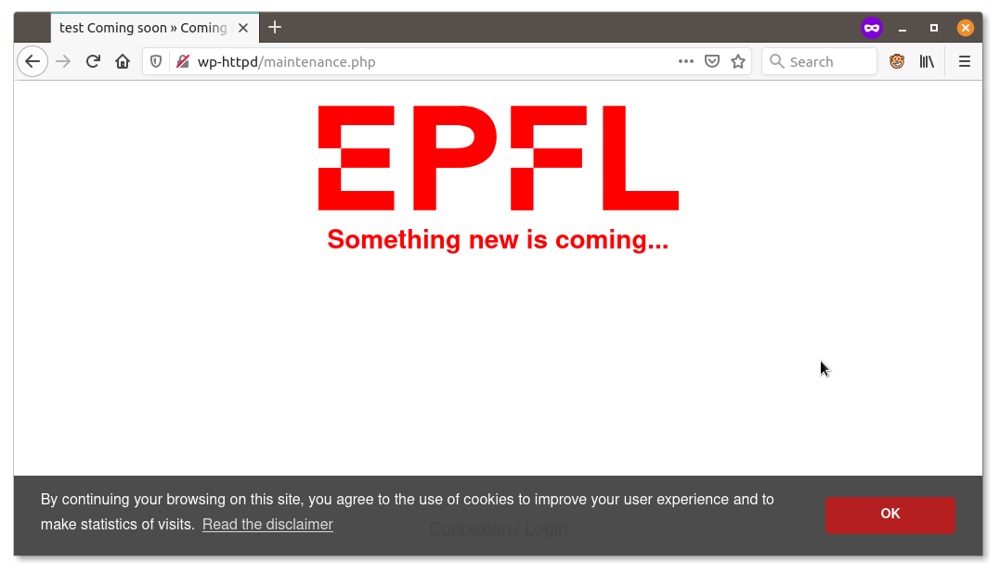

# EPFL Coming Soon

A WordPress plugin that allows to display a coming soon / maintenance page.

## Features
  * Simple **ON / OFF** mode
  * Edit coming soon page in the wordpress **WYSIWYG** editor (TinyMCE)
  * Edit the page's title
  * Option to **redirect on the theme** `maintenance.php` page if present (has to be self-contained for now)
  * Option to send a **[HTTP status code 503](https://httpstatuses.com/503)** along with the page
  * Auto-activated if the `.maintenance` file is present (see https://developer.wordpress.org/cli/commands/maintenance-mode/), i.e. `wp cli maintenance-mode activate` : **wp cli compatible**
  * Shows its status in the **rest API**, `wp-json/epfl-coming-soon/v1/status`

## Screenshot

### Backend

### Frontend

## Issues
Feel free to share your thoughts, issues, remarks and comments here: <https://github.com/epfl-si/wp-plugin-epfl-coming-soon/issues/new/choose>.